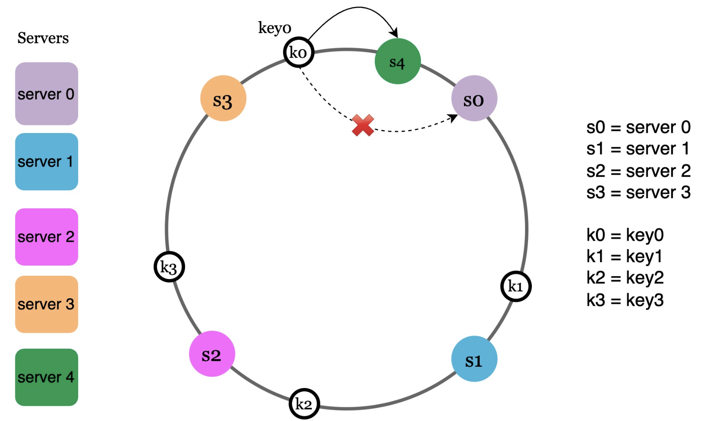
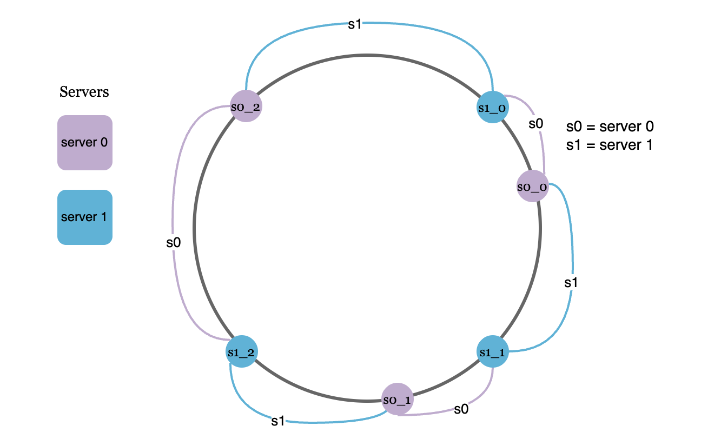

# Consistent Hashing

A minimal Go implementation of **consistent hashing** with virtual nodes for distributed load balancing and data partitioning. It routes requests to servers while minimizing key movement when servers are added or removed.

---

## Features

- Consistent hashing with **virtual nodes** (replicas)
- **O(log n)** request routing via binary search
- Minimal key redistribution on topology changes
- Simple, idiomatic Go API

---

## Consistent Hashing



---

## Virtual Nodes



## Quick Start

```go
// Create a ring with 100 virtual nodes per server
ring := NewHashRing(100)

ring.AddServer("10.0.0.1")
ring.AddServer("10.0.0.2")
ring.AddServer("10.0.0.3")

server := ring.GetNearestServer("request-id")
fmt.Println("Route to:", server)
```

---

## API

### `NewHashRing(replicas int) *HashRing`

Creates a new hash ring.

- `replicas`: virtual nodes per server (typical: 100–200)

---

### `AddServer(serverID string)`

Adds a server and its virtual nodes to the ring.

```go
ring.AddServer("10.0.0.4")
```

---

### `RemoveServer(serverID string)`

Removes a server and all its virtual nodes.

```go
ring.RemoveServer("10.0.0.2")
```

---

### `GetNearestServer(key string) string`

Returns the server responsible for a given key.

```go
server := ring.GetNearestServer("user-123")
```

Returns an empty string if the ring is empty.

---

## How It Works (Brief)

- Both servers and keys are hashed into the same 32-bit space
- Servers are placed on a **ring** using multiple virtual nodes
- A key is assigned to the **next server clockwise** on the ring
- Adding/removing a server only affects nearby keys (~1/n)

---

## Data Structures

```go
type HashRing struct {
    replicas int
    ring     map[uint32]string // hash → server
    keys     []uint32          // sorted hashes
}
```

---

## Complexity

| Operation        | Time       |
| ---------------- | ---------- |
| AddServer        | O(k log r) |
| RemoveServer     | O(k + r)   |
| GetNearestServer | O(log r)   |

- `k` = replicas per server
- `r` = total virtual nodes

Space: **O(n · k)**

---

## Hash Function

- Uses Go’s `hash/crc32`
- Fast and well-distributed
- Suitable for consistent hashing (non-cryptographic)
